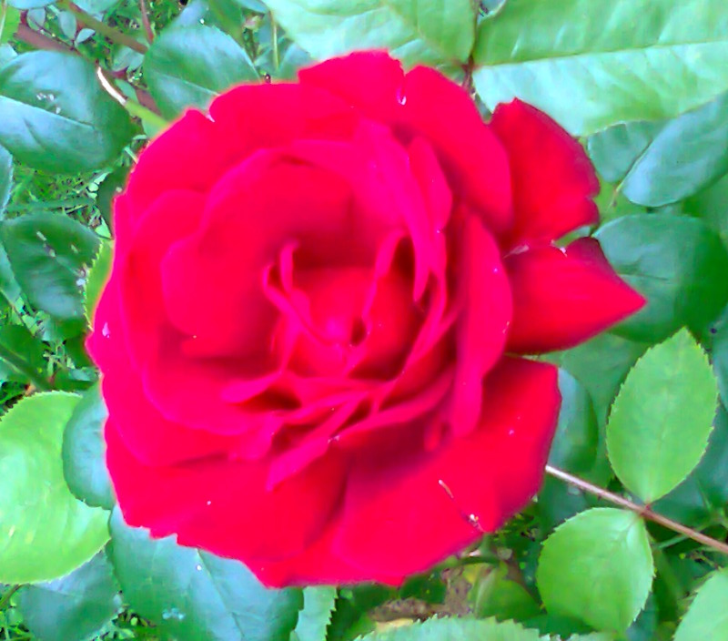
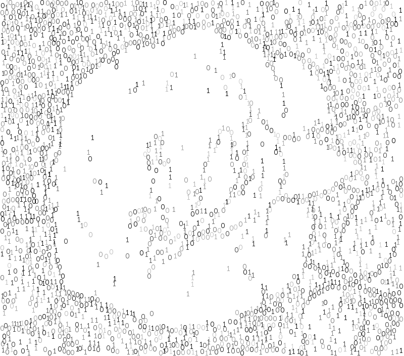
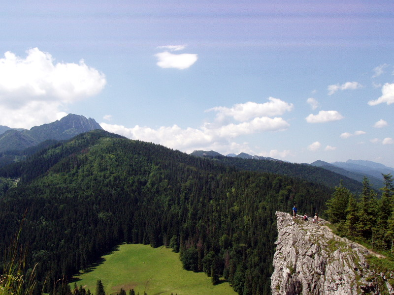
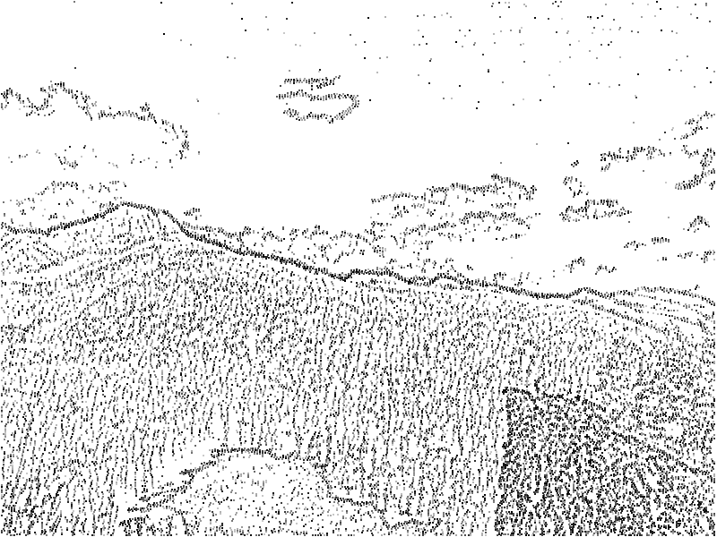
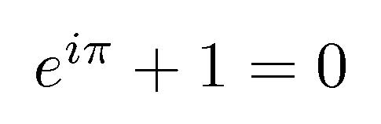
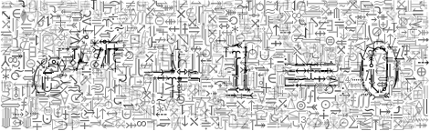

glyphify
========

A toy command-line utility to approximate an image using a fixed set of glyphs.

```bash
./glyphify.lua <glyphs> <image>
```

Examples
--------

### Binary Rose

For a start, lets redraw an image with just zeros and ones:

```bash
./glyphify.lua matrix examples/rose.jpg
```




### Dotted Landscape

The dot glyphset has just a single dot glyph, and more than the default 2500
of these are needed to compose a larger picture:

```bash
./glyphify.lua dot examples/landscape.jpg -n 20000
```




### Mathy Euler

For a very sharp image and complex glyphs we need more extensive search
and a looser acceptance condition:

```bash
./glyphify.lua math examples/euler.jpg -q 30000 --min_value -2.7
```

You could also add `--min_opacity 1` to avoid the symbolic background. Or try
`./glyphify.lua --help` for a full list of options.




Installation
------------

Make sure you have [LuaJIT][] and [Torch][] installed and type:

```bash
luarocks install glyphify
```

[LuaJIT]: http://luajit.org/download.html
[Torch]: http://torch.ch/docs/getting-started.html#installing-torch


License
-------

The code is licensed under [MIT][]. The included glyphs were extracted from
DejaVu Serif font which is also covered by a generous [license][].

[MIT]: LICENSE.txt
[license]: http://dejavu-fonts.org/wiki/License
